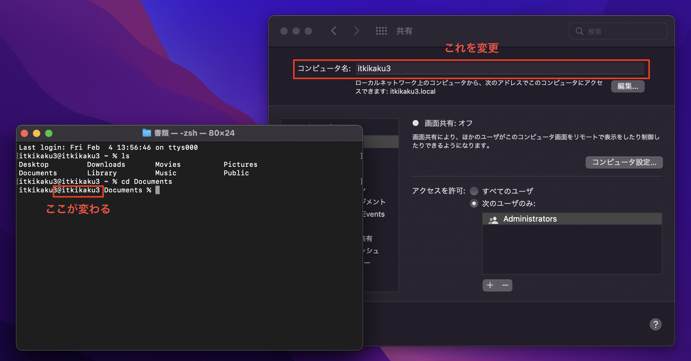
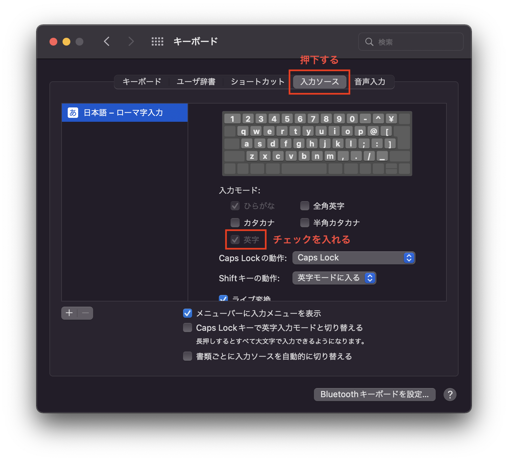
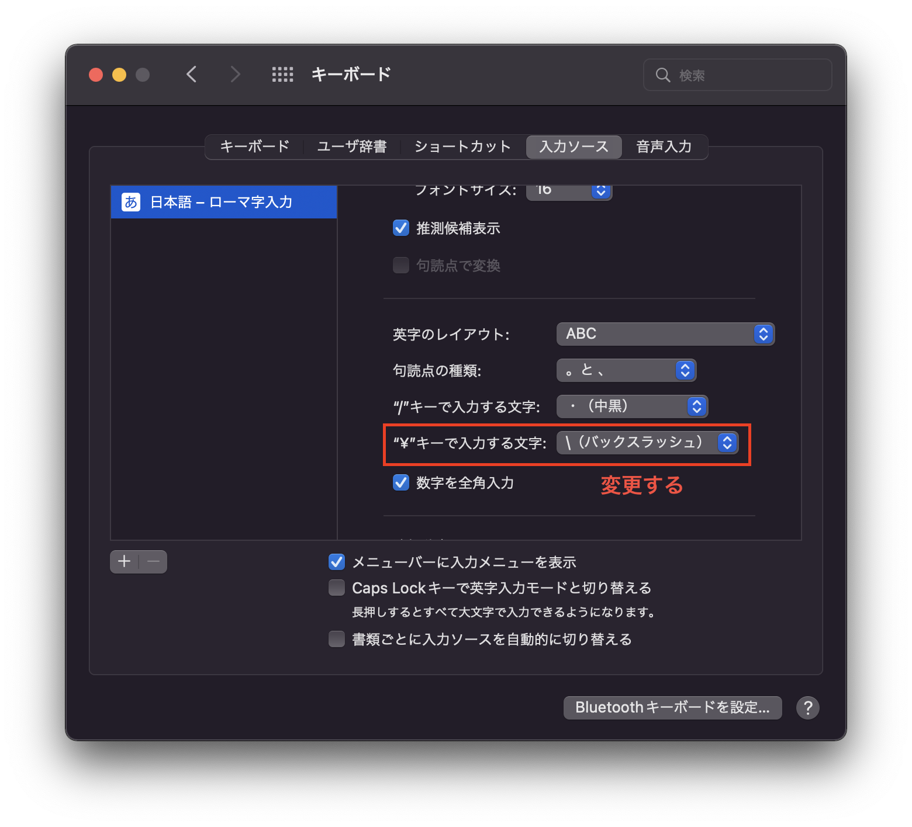
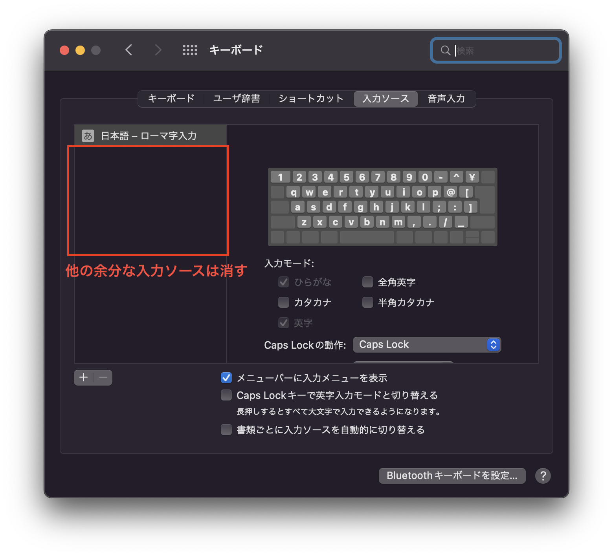

# Mac環境構築

## XCode Command Line Toolsのインストール

XCode Command Line Toolsとは開発に必要な基本的なコマンドをまとめたもの。`git`や`make`などが入っている。「開発に必要な」はAppleの基準。コマンドは`/Library/Developer/CommandLineTools`にインストールされる。

以下のコマンドを実行する。

``` shell
xcode-select --install
```

### 参考

- https://developer.apple.com/library/archive/technotes/tn2339/_index.html

## HomeBrewのインストール

以下のコマンドを実行する。

```
/bin/bash -c "$(curl -fsSL https://raw.githubusercontent.com/Homebrew/install/HEAD/install.sh)"
```

以下のコマンドを実行する。

```
echo '# homebrewのPath設定\neval "$(/opt/homebrew/bin/brew shellenv)"' >> ~/.zshrc
source ~/.zshrc
```

> Homebrewの出力では`.zprofile`に記載するように書かれているが、ログインシェルとインタラクティブシェルでhomebrewが使えるように`.zshrc`に記載する。

以下のコマンドを実行して、最新のソフトウェア（Formulaeという）のリストを取得する。

```
brew update
```

### 参考

- https://brew.sh/index_ja
- https://qiita.com/muran001/items/7b104d33f5ea3f75353f

## 各種ソフトウェアのインストール

### Visual Studio Code

以下のコマンドを実行する。

```
brew install --cask visual-studio-code
```

拡張機能をインストールする。

```
code --install-extension ms-vscode-remote.remote-containers --force
```

### Docker Desktop

以下のコマンドを実行する。

```
brew install --cask docker
```

### Github Desktop

以下のコマンドを実行する。

```
brew install --cask github
```

## その他に変えといた方が良いもの

### コンピューター名を変更する

`システム環境設定`の`共有`からコンピュータ名を変更する。ターミナル上のコンピュータ名の表示が変わる。



### バックスラッシュの入力を優先する

`システム環境設定`の`キーボード` → `入力ソース`から英字入力モードを追加する。



￥キーで入力する文字を変更する。



余分な入力ソースを削除する。


